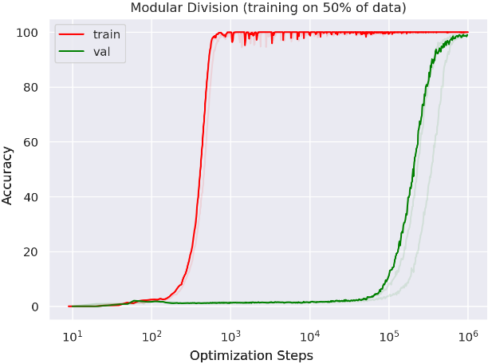
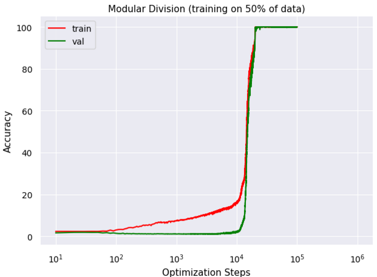

# Grokking Replication

Grokking original paper: https://arxiv.org/pdf/2201.02177.pdf

Setup:
```commandline
pip install -r requirements.txt
```

Running:
```commandline
python main.py
```

Generating a graph
```commandline
python graph.py
```
## Accuracy curves from the grokking paper

## Accuracy curves generated with this repo

